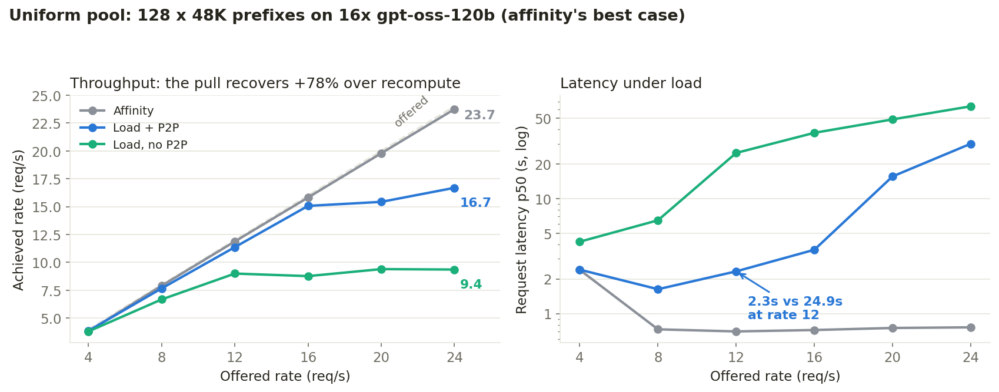
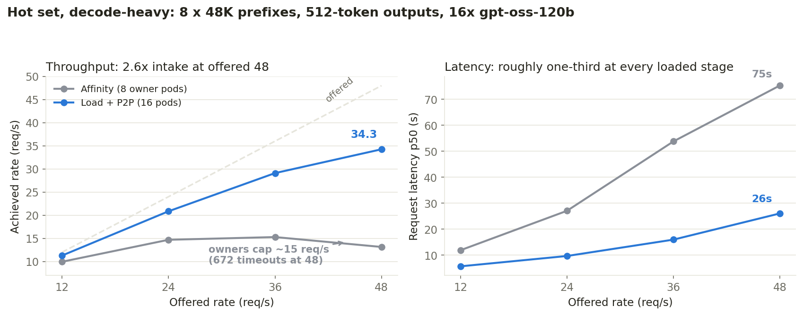
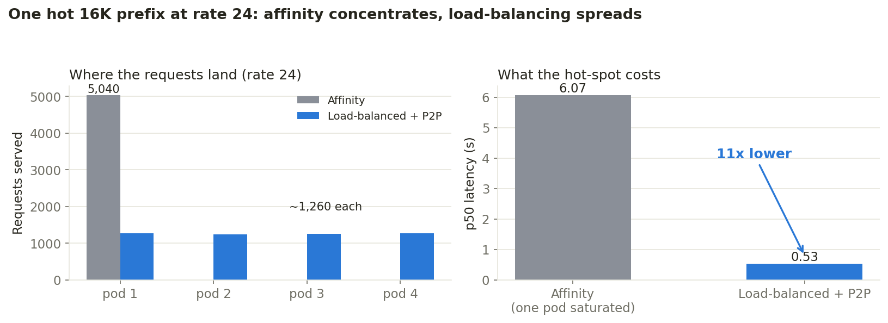
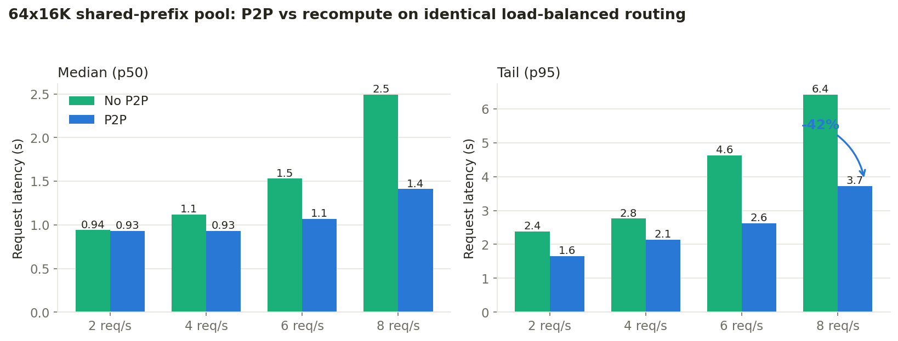
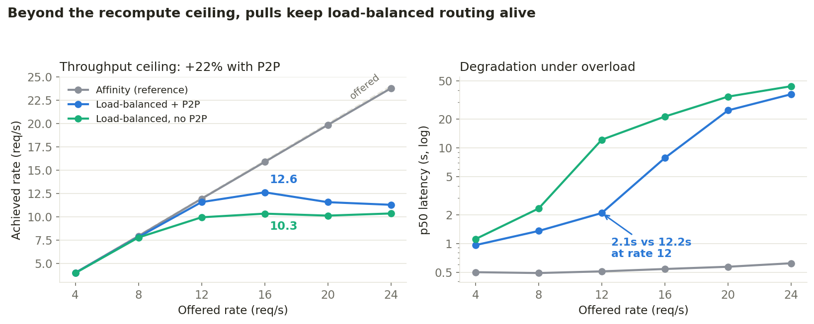
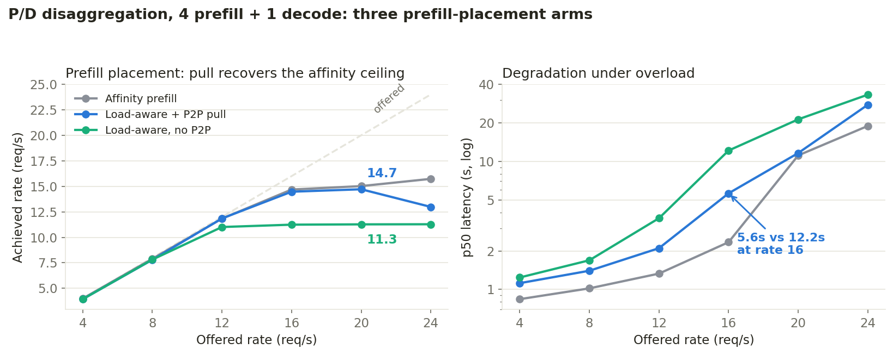

# P2P KV Cache Sharing - Benchmark Results

All measured results for peer-to-peer KV cache sharing in llm-d, across two
rigs: a 4-GPU Llama-3.1-8B deployment (small scale, plus a P/D variant) and a
16-GPU gpt-oss-120b deployment (scale-out). Robustness defects found along
the way, their fixes, and reproducers are in [README.md](README.md).

**Metrics used in every table.** *Prefill latency* = time to first token for
a single request (ms). *Achieved rate* = successful requests per second the
system actually sustained at a given offered (client-side) rate; achieved
tracking offered means the system keeps up, achieved flattening below
offered means saturation. *Request latency p50/p95* = median / 95th
percentile end-to-end latency of successful requests (send to last token),
in seconds. *TTFT* = time to first token under load. *Fails* = requests
that hit the client timeout (120s).

## What is measured

Three routing arms, identical pods and workload in every comparison; only
the EPP scheduling config changes:

1. **Affinity** - precise (KV-event-fed) prefix-cache affinity scoring.
   Requests steer to the pod that owns their prefix.
2. **Load, no P2P** - load-balanced placement (queue + KV-utilization
   scorers). Every cross-pod request recomputes its prefix: the recompute
   floor.
3. **Load + P2P** - the same load-balanced placement plus the
   `p2p-source-producer`: when a peer holds at least `minCachedTokenDelta`
   more cached prefix tokens than the scheduled pod, the router attaches a
   KV-source header and the pod pulls the prefix from that peer
   (CPU-to-CPU over NIXL/UCX) instead of recomputing it.

The hot-set scenario adds two control arms with the canonical production
scorer blend (prefix 3 / queue 2 / kv-utilization 2), with and without P2P.

## Hardware and software

| | Small scale (Llama) | Scale-out (gpt-oss) |
|---|---|---|
| Model | `meta-llama/Llama-3.1-8B-Instruct` | `openai/gpt-oss-120b` (MXFP4) |
| Pods | 4x TP=1 (P/D variant: 4 prefill + 1 decode) | 16x TP=1 |
| GPU | NVIDIA H200 (CoreWeave) | NVIDIA H200 (CoreWeave) |
| Interconnect | RDMA (NIXL/UCX) | RDMA (NIXL/UCX) |
| KV per token | ~128 KB | ~41.5 KB (hybrid GQA + sliding window) |
| GPU KV per pod | ~0.5M tokens | ~1.38M tokens (`--gpu-memory-utilization=0.85`, `--max-model-len=65536`) |
| CPU offload tier | 32 GiB per pod | 64 GiB per pod (`/dev/shm` 96 Gi) |
| vLLM block size | 64 (matches router `blockSize`) | 64 (matches router `blockSize`) |
| `minCachedTokenDelta` | 2048 | 2048 (re-derived from the crossover below) |
| vLLM | nightly + `generic_p2p` OffloadingConnector branch + the robustness fixes in [README.md](README.md) | same |
| Router | llm-d inference gateway EPP: `token-producer` + `precise-prefix-cache-producer` (+ `p2p-source-producer` on the P2P arms) | same |
| Load generator | inference-perf (`shared_prefix` datagen), llm-d-benchmark harness | same |

Methodology notes that materially affect results:

* Every run is preceded by mechanism-engaged gates (prefix index populated,
  source header firing, `vllm:external_prefix_cache_hits_total` rising) and
  a full mesh warm-up (every directed pod pair exchanges one pull) so
  cold-session setup is excluded.
* `PYTHONHASHSEED` pinned fleet-wide; without it block hashes never match
  across pods and P2P silently measures zero.
* The EPP tokenizes every request via a render service; an under-provisioned
  render saturates and stalls every request for exactly the token-producer
  timeout, flattening all arms to the same false plateau
  ([llm-d-router#2025](https://github.com/llm-d/llm-d-router/issues/2025)).
  gpt-oss runs use 6-10 render replicas (~10 req/s capacity per replica at
  ~50K-token prompts); results below were re-measured after this fix.

## Scale-out: 16x gpt-oss-120b

### Pull versus recompute (single request)

Fresh prefix seeded on one pod; single-request prefill latency measured on
a cold pod with and without the pull. 5-rep medians, warm mesh, unique
prefix per rep.

| prefix tokens | prefill latency, recompute | prefill latency, P2P pull | delta |
|---|---|---|---|
| 2,048 | 70.6 ms | 49.0 ms | -31% |
| 8,192 | 205.4 ms | 120.1 ms | -42% |
| 16,384 | 426.3 ms | 196.2 ms | -54% |
| 32,768 | 983.0 ms | 376.3 ms | -62% |
| 49,152 | 1,695 ms | 550.5 ms | -68% |

**Bottom line:** pulling a cached prefix from a peer is faster than
recomputing it at every measured length, and the gap grows with length -
gpt-oss's compact KV (41.5 KB/token) makes the transfer cheap enough to
beat even its fast MoE prefill (~29K tokens/s). This sets the per-miss
economics everything below builds on, and the smallest winning length sets
the router threshold (`minCachedTokenDelta: 2048`).

### Uniform pool (scenario A)

128 shared prefixes x 48K tokens (~6M-token working set - 4.4x one pod's
GPU cache, so the fleet holds the pool but no single pod does), 256-token
questions, 64 output tokens, constant-rate stages of 60s each. Uniform
popularity is affinity's best case.

Each cell: **achieved rate (req/s) / request latency p50 (s)**.

| offered rate | Affinity | Load, no P2P | Load + P2P |
|---|---|---|---|
| 4 req/s | 3.8 / 2.4s | 3.8 / 4.2s | 3.9 / 2.4s |
| 8 req/s | 7.9 / 0.7s | 6.7 / 6.5s | 7.7 / 1.6s |
| 12 req/s | 11.9 / 0.7s | 9.0 / 24.9s | 11.4 / 2.3s |
| 16 req/s | 15.8 / 0.7s | 8.8 / 37.3s | 15.1 / 3.6s |
| 20 req/s | 19.8 / 0.7s | 9.4 / 48.8s | 15.4 / 15.6s |
| 24 req/s | 23.7 / 0.8s | 9.4 / 63.5s | 16.7 / 30.0s |

What the table shows: affinity is near-ideal (achieved tracks offered to
23.7 req/s at flat sub-second latency, zero failures) because each pod
owns ~8 of the 128 prefixes - 384K tokens, comfortably GPU-resident - so
every request is a local cache hit. The recompute arm saturates at ~9.4
req/s: every cross-pod placement re-prefills 48K tokens and the fleet
drowns in prefill. The pull arm tracks offered to 16 req/s and saturates
at 16.7 (+78% over recompute, about half of the throughput gap to the
affinity ceiling), with 2.3s vs 24.9s p50 at 12 req/s - but stays 3-5x
slower on p50 than affinity even in its tracking band, because a pull
costs ~0.5s where a local hit costs nothing. ~139M prefix tokens were
pulled (~58% of requests). Zero failures, zero restarts, all arms.

**Bottom line:** when the working set is bigger than any one pod's cache
and placement is load-aware, P2P converts each cache miss from a 1.7s
recompute into a 0.55s pull: +78% sustained throughput and an
order-of-magnitude latency win over recompute under load. It does not
catch pure affinity on a uniform pool - affinity misses nothing here.

### Hot set, decode-heavy (scenario B)

8 shared prefixes x 48K tokens, 256-token questions, 512-token outputs
(decode-heavy), constant-rate stages of 60s. The hot set fits in every
pod's GPU cache (384K of ~1.38M tokens), so cache capacity cannot
differentiate the arms - what differentiates them is where the decode load
lands: affinity funnels everything into the 8 owner pods while half the
fleet idles; load-aware placement spreads it 16 ways.

Each cell: **achieved rate (req/s) / request latency p50 (s) / fails**.

| offered rate | Affinity (8 owners) | Load, no P2P | Load + P2P |
|---|---|---|---|
| 12 req/s | 9.9 / 11.8s / 0 | 11.1 / 9.4s / 0 | 11.3 / 5.6s / 0 |
| 24 req/s | 14.7 / 27.0s / 0 | 20.8 / 9.7s / 0 | 20.9 / 9.6s / 0 |
| 36 req/s | 15.3 / 53.8s / 0 | 29.3 / 16.4s / 0 | 29.1 / 15.9s / 0 |
| 48 req/s | 13.1 / 75.3s / 672 | 33.4 / 27.7s / 0 | 34.3 / 26.0s / 0 |

What the table shows: the affinity arm's 8 owner pods cap near 15 req/s
aggregate and shed 672 requests to the 120s timeout at offered 48, while
both load-aware arms take ~2.5x that throughput at a third of the latency
with zero failures. The two load-aware arms are within 1-3% of each other
from the second stage onward - we predicted this before running the
control: the hot set is cache-resident, so the no-P2P arm pays each
prefix's recompute once per pod (~128 one-time recomputes) and then serves
local hits exactly like the P2P arm. The pull's measurable contribution is
the acquisition transient in the first stage: p50 5.6s vs 9.4s (-40%) and
p95 9.5s vs 26.2s while the fleet acquires the hot set, because a pull
costs a third of a recompute. The control arm's `ext_hits` delta is zero
(no pulls - a clean control); the P2P arm pulled ~5.9M tokens, exactly one
acquisition of the 8 prefixes by each of the 15 non-owner pods.

**Bottom line:** the 2.5x win over affinity on a cache-resident hot set
belongs to load-aware placement, not to P2P; P2P makes the fleet's
acquisition of hot content ~3x cheaper but adds nothing at steady state in
this regime. P2P's throughput case is scenario A's regime (working set
exceeds per-pod cache); its hot-set role is cheap propagation. Blended
scorer arms (production defaults, with and without P2P) are being measured
to close the remaining framing question.

## Small scale: 4x Llama-3.1-8B-Instruct

### Pull versus recompute (single request)

Same protocol as the gpt-oss crossover; single-request prefill latency.

| prefix tokens | prefill latency, recompute | prefill latency, P2P pull | delta |
|---|---|---|---|
| 1,024 | 30 ms | 34 ms | +11% |
| 4,096 | 99 ms | 59 ms | -41% |
| 8,192 | 236 ms | 88 ms | -63% |
| 16,384 | 503 ms | 155 ms | -69% |

**Bottom line:** the crossover sits near 2K tokens - below it recompute
wins, above it the pull wins and the gap grows. This is where
`minCachedTokenDelta: 2048` comes from: the router only requests a pull
when a peer holds at least a crossover-length advantage.

### One hot 16K prefix

Single hot prefix, all traffic, offered rate ramped to 24 req/s.

**Bottom line:** affinity concentrates all 5,040 requests on the prefix
owner and saturates it (request latency p50 6.1s at rate 24); simple
load-balanced routing holds p50 0.53s - an 11x latency win from placement
alone. P2P adds nothing for a single persistent prefix (each pod
recomputes it once and it stays resident); its role is making load-aware
placement affordable when prefixes do NOT fit everywhere - the pool
scenario below.

### Shared-prefix pool: 64 x 16K (128 GiB KV pool, exceeds fleet cache)

Load-balanced placement in both arms; the only difference is whether a
cross-pod request recomputes its 16K prefix or pulls it from the holder.

Moderate rates - each cell: **request latency p50 / p95 (s)**, plus TTFT
p50 in the last column:

| offered rate | no-P2P lat p50 / p95 | P2P lat p50 / p95 | TTFT p50, P2P vs no-P2P |
|---|---|---|---|
| 2 req/s | 0.94s / 2.38s | 0.93s / 1.65s | 0.40s vs 0.57s |
| 4 req/s | 1.12s / 2.76s | 0.93s / 2.14s | 0.42s vs 0.57s |
| 6 req/s | 1.53s / 4.62s | 1.07s / 2.62s | 0.56s vs 0.59s |
| 8 req/s | 2.49s / 6.41s | 1.41s / 3.72s | 0.59s vs 0.79s |

High rates - each cell: **achieved rate (req/s) / request latency p50 (s)**:

| offered rate | no-P2P | P2P |
|---|---|---|
| 12 req/s | 9.9 / 12.2s | 11.6 / 2.1s |
| 16 req/s | 10.3 / 21.3s | 12.6 / 7.8s |
| 20 req/s | 10.1 / 34.3s | 11.6 / 24.6s |
| 24 req/s | 10.4 / 44.1s | 11.3 / 36.4s |

**Bottom line:** with a working set no pod can cache, the pull beats
recompute at every rate and the gap grows with load: -43% p50 at 8 req/s,
a +22% higher saturation ceiling (12.6 vs 10.3 req/s achieved), up to 83%
lower p50 in the 12-16 req/s band, and 30% higher peak token throughput
(3,184 vs 2,420 tok/s). Same regime and same conclusion as gpt-oss
scenario A, at a quarter the scale.

### P/D disaggregation: prefill placement

4 prefill + 1 decode, NIXL between the legs, same pool workload, three
prefill-placement arms.

**Bottom line:** affinity placement saturates at ~15.7 req/s - the single
decode pod's KV intake, not prefill placement, is this topology's ceiling.
Load-aware placement without P2P is recompute-bound at ~11.3 req/s
(request latency p50 33s); adding the pull returns it to the decode-bound
ceiling: ~14.7 req/s (+30%), p50 5.6s vs 12.2s at 16 req/s. The pull is
what makes load-aware prefill placement viable under P/D. Zero failures
and restarts across all three arms (15,123 requests).

## Overall conclusion

P2P KV sharing is miss-cost reduction, not a routing improvement: it
converts a prefix-cache miss from "recompute the whole prefix" into "copy
it from a peer at about a third of the cost". Its measured value is
therefore largest where misses are frequent and expensive - working sets
that exceed per-pod cache under load-aware placement (+78% throughput on
gpt-oss, +22-30% on Llama aggregated and P/D, with order-of-magnitude p50
wins over recompute under load) - and smallest where misses are rare
(cache-resident hot sets: a one-time ~3x cheaper acquisition). It also
decouples cache-friendliness from placement freedom: schedulers can place
for load, drain, or scale without paying a recompute tax on long prefixes.
