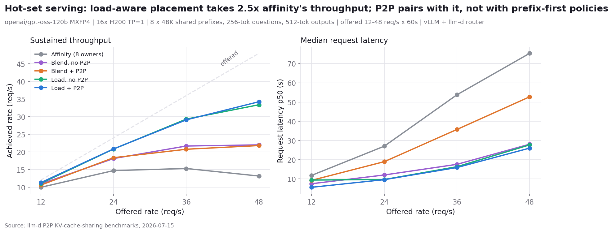
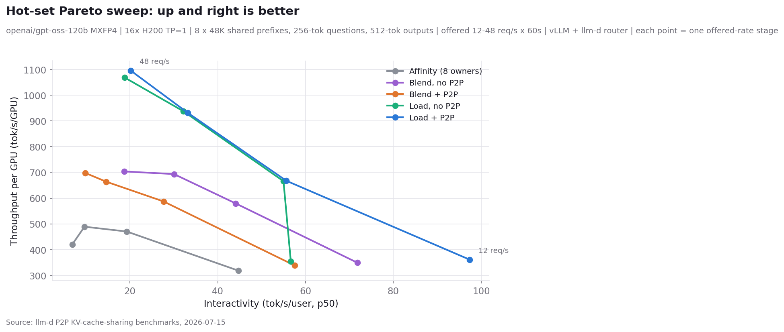
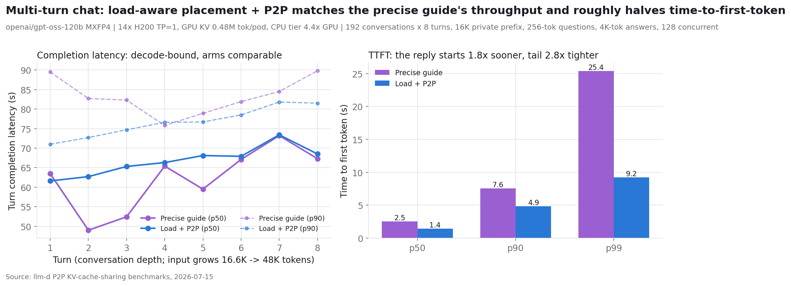

# P2P KV Cache Sharing - Benchmark Results

All measured results for peer-to-peer KV cache sharing in llm-d, across two
rigs: a 4-GPU Llama-3.1-8B deployment (small scale, plus a P/D variant) and a
16-GPU gpt-oss-120b deployment (scale-out). Robustness defects found along
the way, their fixes, and reproducers are in [README.md](README.md).

**Metrics used in every table.** *Prefill latency* = time to first token for
a single request (ms). *Achieved rate* = successful requests per second the
system actually sustained at a given offered (client-side) rate; achieved
tracking offered means the system keeps up, achieved flattening below
offered means saturation. *Request latency p50/p95* = median / 95th
percentile end-to-end latency of successful requests (send to last token),
in seconds. *TTFT* = time to first token under load. *Fails* = requests
that hit the client timeout (120s). *Decode throughput* = achieved rate x
nominal output length (derived; the harness's raw output-tokens/s is
skewed by a rare full-prompt-echo anomaly, and prompt-inclusive tokens/s
would count cache hits as computed work).

## What is measured

Three routing arms, identical pods and workload in every comparison; only
the EPP scheduling config changes:

1. **Affinity** - precise (KV-event-fed) prefix-cache affinity scoring.
   Requests steer to the pod that owns their prefix.
2. **Load, no P2P** - load-balanced placement (queue + KV-utilization
   scorers). Every cross-pod request recomputes its prefix: the recompute
   floor.
3. **Load + P2P** - the same load-balanced placement plus the
   `p2p-source-producer`: when a peer holds at least `minCachedTokenDelta`
   more cached prefix tokens than the scheduled pod, the router attaches a
   KV-source header and the pod pulls the prefix from that peer
   (CPU-to-CPU over NIXL/UCX) instead of recomputing it.

The hot-set scenario adds two control arms with the canonical production
scorer blend (prefix 3 / queue 2 / kv-utilization 2), with and without P2P.

## Hardware and software

| | Small scale (Llama) | Scale-out (gpt-oss) |
|---|---|---|
| Model | `meta-llama/Llama-3.1-8B-Instruct` | `openai/gpt-oss-120b` (MXFP4) |
| Pods | 4x TP=1 (P/D variant: 4 prefill + 1 decode) | 16x TP=1 |
| GPU | NVIDIA H200 (CoreWeave) | NVIDIA H200 (CoreWeave) |
| Interconnect | RDMA (NIXL/UCX) | RDMA (NIXL/UCX) |
| KV per token | ~128 KB | ~41.5 KB (hybrid GQA + sliding window) |
| GPU KV per pod | ~0.5M tokens | ~1.38M tokens (`--gpu-memory-utilization=0.85`, `--max-model-len=65536`) |
| CPU offload tier | 32 GiB per pod | 64 GiB per pod (`/dev/shm` 96 Gi) |
| vLLM block size | 64 (matches router `blockSize`) | 64 (matches router `blockSize`) |
| `minCachedTokenDelta` | 2048 | 2048 (re-derived from the crossover below) |
| vLLM | nightly + `generic_p2p` OffloadingConnector branch + the robustness fixes in [README.md](README.md) | same |
| Router | llm-d inference gateway EPP: `token-producer` + `precise-prefix-cache-producer` (+ `p2p-source-producer` on the P2P arms) | same |
| Load generator | inference-perf (`shared_prefix` datagen), llm-d-benchmark harness | same |

Methodology notes that materially affect results:

* Every run is preceded by mechanism-engaged gates (prefix index populated,
  source header firing, `vllm:external_prefix_cache_hits_total` rising) and
  a full mesh warm-up (every directed pod pair exchanges one pull) so
  cold-session setup is excluded.
* `PYTHONHASHSEED` pinned fleet-wide; without it block hashes never match
  across pods and P2P silently measures zero.
* The EPP tokenizes every request via a render service; an under-provisioned
  render saturates and stalls every request for exactly the token-producer
  timeout, flattening all arms to the same false plateau
  ([llm-d-router#2025](https://github.com/llm-d/llm-d-router/issues/2025)).
  gpt-oss runs use 6-10 render replicas (~10 req/s capacity per replica at
  ~50K-token prompts); results below were re-measured after this fix.

## Scale-out: 16x gpt-oss-120b

### Pull versus recompute (single request)

Fresh prefix seeded on one pod; single-request prefill latency measured on
a cold pod with and without the pull. 5-rep medians, warm mesh, unique
prefix per rep.

| prefix tokens | prefill latency, recompute | prefill latency, P2P pull | delta |
|---|---|---|---|
| 2,048 | 70.6 ms | 49.0 ms | -31% |
| 8,192 | 205.4 ms | 120.1 ms | -42% |
| 16,384 | 426.3 ms | 196.2 ms | -54% |
| 32,768 | 983.0 ms | 376.3 ms | -62% |
| 49,152 | 1,695 ms | 550.5 ms | -68% |

**Bottom line:** pulling a cached prefix from a peer is faster than
recomputing it at every measured length, and the gap grows with length -
gpt-oss's compact KV (41.5 KB/token) makes the transfer cheap enough to
beat even its fast MoE prefill (~29K tokens/s). This sets the per-miss
economics everything below builds on, and the smallest winning length sets
the router threshold (`minCachedTokenDelta: 2048`).

### Uniform pool (scenario A)

128 shared prefixes x 48K tokens (~6M-token working set - 4.4x one pod's
GPU cache, so the fleet holds the pool but no single pod does), 256-token
questions, 64 output tokens, constant-rate stages of 60s each. Uniform
popularity is affinity's best case.

Pool sizing note: the workload parameter that transfers across models is
the ratio of working set to per-pod cache, not the prefix count and
length. The Llama pool below (64 x 16K) is ~2x that rig's 0.5M-token
per-pod cache; on gpt-oss's compact KV the same pool would be 0.76x of
one pod's cache - every pod would hold all of it and every arm would
serve local hits. 128 x 48K is that scenario translated to gpt-oss's
cache geometry.

Each cell: **achieved rate (req/s) / request latency p50 (s)**.

| offered rate | Affinity | Blend, no P2P | Load, no P2P | Load + P2P |
|---|---|---|---|---|
| 4 req/s | 3.8 / 2.4s | 4.0 / 1.9s | 3.8 / 4.2s | 3.9 / 2.4s |
| 8 req/s | 7.9 / 0.7s | 7.9 / 0.7s | 6.7 / 6.5s | 7.7 / 1.6s |
| 12 req/s | 11.9 / 0.7s | 11.9 / 0.7s | 9.0 / 24.9s | 11.4 / 2.3s |
| 16 req/s | 15.8 / 0.7s | 15.8 / 0.7s | 8.8 / 37.3s | 15.1 / 3.6s |
| 20 req/s | 19.8 / 0.7s | 19.8 / 0.8s | 9.4 / 48.8s | 15.4 / 15.6s |
| 24 req/s | 23.7 / 0.8s | 23.7 / 0.8s | 9.4 / 63.5s | 16.7 / 30.0s |

The blend arm (prefix 3 / queue 2 / kv 2, no P2P) is indistinguishable
from pure affinity here: on a uniform pool the owners have capacity, so
the prefix term steers every request to a local hit and the load terms
never need to overrule it. Zero pulls, zero failures.

What the table shows: affinity is near-ideal (achieved tracks offered to
23.7 req/s at flat sub-second latency, zero failures) because each pod
owns ~8 of the 128 prefixes - 384K tokens, comfortably GPU-resident - so
every request is a local cache hit. The recompute arm saturates at ~9.4
req/s: every cross-pod placement re-prefills 48K tokens and the fleet
drowns in prefill. The pull arm tracks offered to 16 req/s and saturates
at 16.7 (+78% over recompute, about half of the throughput gap to the
affinity ceiling), with 2.3s vs 24.9s p50 at 12 req/s - but stays 3-5x
slower on p50 than affinity even in its tracking band, because a pull
costs ~0.5s where a local hit costs nothing. ~139M prefix tokens were
pulled (~58% of requests). Zero failures, zero restarts, all arms.

Decode throughput at peak load (achieved rate x 64 output tokens): 1,519
tok/s affinity, 1,068 tok/s load+P2P, 599 tok/s recompute. Prompt-side
token throughput is deliberately not reported: ~49K of every request's
~49.5K tokens are cache hits (local or pulled), served rather than
computed, so a prompt-inclusive tokens/s figure would overstate work done
by three orders of magnitude.

**Bottom line:** when the working set is bigger than any one pod's cache
and placement is load-aware, P2P converts each cache miss from a 1.7s
recompute into a 0.55s pull: +78% sustained throughput and an
order-of-magnitude latency win over recompute under load. It does not
catch pure affinity on a uniform pool - affinity misses nothing here.

### Hot set, decode-heavy (scenario B)

8 shared prefixes x 48K tokens, 256-token questions, 512-token outputs
(decode-heavy), constant-rate stages of 60s. The hot set fits in every
pod's GPU cache (384K of ~1.38M tokens), so cache capacity cannot
differentiate the arms - what differentiates them is where the decode load
lands: affinity funnels everything into the 8 owner pods while half the
fleet idles; load-aware placement spreads it 16 ways.

Each cell: **achieved rate (req/s) / request latency p50 (s)**. Fails were
zero everywhere except the affinity arm at offered 48 (672).

| offered rate | Affinity (8 owners) | Blend, no P2P | Blend + P2P | Load, no P2P | Load + P2P |
|---|---|---|---|---|---|
| 12 req/s | 9.9 / 11.8s | 10.9 / 7.5s | 10.6 / 9.3s | 11.1 / 9.4s | 11.3 / 5.6s |
| 24 req/s | 14.7 / 27.0s | 18.1 / 12.0s | 18.4 / 19.0s | 20.8 / 9.7s | 20.9 / 9.6s |
| 36 req/s | 15.3 / 53.8s | 21.7 / 17.6s | 20.8 / 35.7s | 29.3 / 16.4s | 29.1 / 15.9s |
| 48 req/s | 13.1 / 75.3s | 22.0 / 28.1s | 21.8 / 52.7s | 33.4 / 27.7s | 34.3 / 26.0s |

Blend = the canonical production scorer mix (prefix 3 / queue 2 /
kv-utilization 2, max-score picker).

What the table shows: the affinity arm's 8 owner pods cap near 15 req/s
aggregate and shed 672 requests to the 120s timeout at offered 48, while
both load-aware arms take ~2.5x that throughput at a third of the latency
with zero failures. The two load-aware arms are within 1-3% of each other
from the second stage onward - we predicted this before running the
control: the hot set is cache-resident, so the no-P2P arm pays each
prefix's recompute once per pod (~128 one-time recomputes) and then serves
local hits exactly like the P2P arm. The pull's measurable contribution is
the acquisition transient in the first stage: p50 5.6s vs 9.4s (-40%) and
p95 9.5s vs 26.2s while the fleet acquires the hot set, because a pull
costs a third of a recompute. The control arm's `ext_hits` delta is zero
(no pulls - a clean control); the P2P arm pulled ~5.9M tokens, exactly one
acquisition of the 8 prefixes by each of the 15 non-owner pods.

Decode throughput at offered 48 (achieved rate x 512 output tokens):
17.5K tok/s load+P2P, 17.1K load-no-P2P, 6.7K affinity - the same 2.5x,
expressed as decode work per second.

The blend arms answer the "would the production default cover this?"
question: no. Both blend arms cap near 22 req/s - 1.7x affinity, but 35%
below pure load - because the prefix term keeps steering to owners until
their queues force a spill; the p95s (~90s in both blend arms) show the
requests that stayed on hot owners paying for it. Adding P2P to the blend
changes nothing (the two blend arms differ within run-to-run variance,
single runs each): with prefix-first placement the scheduled pod almost
always already holds the prefix, so there is nothing to pull - the
blend+P2P arm moved 98K tokens all run, two prefix-acquisitions' worth,
against the load+P2P arm's 5.9M.

**Bottom line:** the 2.5x win over affinity on a cache-resident hot set
belongs to load-aware placement, not to P2P; P2P makes the fleet's
acquisition of hot content ~3x cheaper but adds nothing at steady state in
this regime. The blend control adds the pairing rule: P2P only helps a
policy that generates misses by spreading - it composes with load-aware
placement and is nearly inert under prefix-first placement. P2P's
throughput case is scenario A's regime (working set exceeds per-pod
cache); its hot-set role is cheap propagation.

### Multi-turn chat (scenario C)

A turn is one round-trip in a conversation: the user sends a message, the
model answers - one request to the fleet. Each turn's request carries the
entire conversation so far as its prompt (the 16K system prompt plus every
previous question and answer), so turn 1 arrives with ~16.6K input tokens
and turn 8 with ~48K. The deeper the turn, the more KV there is to reuse if
the request lands where that history is cached or can be pulled - and the
more expensive a recompute if not. Results below are split by turn for that
reason; turns are inferred from input size (~192 requests per bucket,
matching one request per conversation per turn).

Workload: 192 conversations, each with a private 16,384-token system
prompt, 8 turns of 256-token questions and 4,096-token answers, 128
conversations active concurrently (`conversation_replay` datagen; the
`shared_prefix` multi-turn path silently degrades to single-turn -
kubernetes-sigs/inference-perf#616 - and was not used). Rig for this
scenario: 14x TP=1, `--gpu-memory-utilization=0.60` (GPU KV ~0.48M
tokens/pod, so 128 growing conversations exceed fleet GPU cache and
sessions evict), CPU tier 88 GiB = 4.4x GPU, verified before the run. Both
arms run the router image with load-aware P2P source selection
(llm-d-router#2032).

Arms: the precise guide's canonical blend (prefix 3 / queue 2 /
kv-utilization 2, max-score picker) versus load-aware placement + P2P.

**Time to first token** - the interval a chat user waits before the reply
starts, and the metric placement actually controls (completion latency is
~95% decode at 4K-token answers):

| TTFT | Precise guide | Load + P2P |
|---|---|---|
| p50 | 2.53s | **1.42s** |
| p90 | 7.56s | **4.87s** |
| p99 | 25.4s | **9.2s** |

**Turn completion latency** (each cell: p50 / p90, seconds):

| turn | Precise guide | Load + P2P |
|---|---|---|
| 1 | 63.5 / 89.5 | 61.6 / 71.0 |
| 2 | 49.0 / 82.7 | 62.7 / 72.7 |
| 4 | 65.4 / 75.8 | 66.3 / 76.6 |
| 6 | 67.1 / 81.9 | 67.9 / 78.5 |
| 8 | 67.3 / 89.8 | 68.5 / 81.5 |
| ALL | 64.5 / 84.5 | 65.8 / **78.3** |

Throughput 1.86 vs 1.90 turns/s; 17 errors of 1,536 in each arm (client
timeouts). Pull evidence: the P2P arm moved 32.5M tokens of conversation
KV (~670 full-context transfers) with zero restarts; the affinity arm's
mid-turn p50 wins (turns 2-3, 5) are sessions served entirely from their
home pod's GPU cache.

**Bottom line:** on multi-turn chat the two arms tie on throughput and
completion latency, and split on tails and TTFT: the precise guide is
fastest when a session stays home on warm cache, but an evicted or
displaced session pays a full ~50K recompute before its first token (the
25.4s TTFT p99); load+P2P pulls the history instead, starting replies 1.8x
sooner at median and capping the tail at 9.2s. First scenario where
load+P2P beats the tuned default on a user-facing metric rather than
recovering a recompute floor. Single run per arm; a repeat and a
shorter-output variant (raising prefill's share of latency) are the
follow-ups.

## Small scale: 4x Llama-3.1-8B-Instruct

### Pull versus recompute (single request)

Same protocol as the gpt-oss crossover; single-request prefill latency.

| prefix tokens | prefill latency, recompute | prefill latency, P2P pull | delta |
|---|---|---|---|
| 1,024 | 30 ms | 34 ms | +11% |
| 4,096 | 99 ms | 59 ms | -41% |
| 8,192 | 236 ms | 88 ms | -63% |
| 16,384 | 503 ms | 155 ms | -69% |

**Bottom line:** the crossover sits near 2K tokens - below it recompute
wins, above it the pull wins and the gap grows. This is where
`minCachedTokenDelta: 2048` comes from: the router only requests a pull
when a peer holds at least a crossover-length advantage.

### One hot 16K prefix

Single hot prefix, all traffic, offered rate ramped to 24 req/s.

**Bottom line:** affinity concentrates all 5,040 requests on the prefix
owner and saturates it (request latency p50 6.1s at rate 24); simple
load-balanced routing holds p50 0.53s - an 11x latency win from placement
alone. P2P adds nothing for a single persistent prefix (each pod
recomputes it once and it stays resident); its role is making load-aware
placement affordable when prefixes do NOT fit everywhere - the pool
scenario below.

### Shared-prefix pool: 64 x 16K (128 GiB KV pool, exceeds fleet cache)

Load-balanced placement in both arms; the only difference is whether a
cross-pod request recomputes its 16K prefix or pulls it from the holder.

Moderate rates - each cell: **request latency p50 / p95 (s)**, plus TTFT
p50 in the last column:

| offered rate | no-P2P lat p50 / p95 | P2P lat p50 / p95 | TTFT p50, P2P vs no-P2P |
|---|---|---|---|
| 2 req/s | 0.94s / 2.38s | 0.93s / 1.65s | 0.40s vs 0.57s |
| 4 req/s | 1.12s / 2.76s | 0.93s / 2.14s | 0.42s vs 0.57s |
| 6 req/s | 1.53s / 4.62s | 1.07s / 2.62s | 0.56s vs 0.59s |
| 8 req/s | 2.49s / 6.41s | 1.41s / 3.72s | 0.59s vs 0.79s |

High rates - each cell: **achieved rate (req/s) / request latency p50 (s)**:

| offered rate | no-P2P | P2P |
|---|---|---|
| 12 req/s | 9.9 / 12.2s | 11.6 / 2.1s |
| 16 req/s | 10.3 / 21.3s | 12.6 / 7.8s |
| 20 req/s | 10.1 / 34.3s | 11.6 / 24.6s |
| 24 req/s | 10.4 / 44.1s | 11.3 / 36.4s |

**Bottom line:** with a working set no pod can cache, the pull beats
recompute at every rate and the gap grows with load: -43% p50 at 8 req/s,
a +22% higher saturation ceiling (12.6 vs 10.3 req/s achieved), up to 83%
lower p50 in the 12-16 req/s band, and 30% higher peak token throughput
(3,184 vs 2,420 tok/s). Same regime and same conclusion as gpt-oss
scenario A, at a quarter the scale.

### P/D disaggregation: prefill placement

4 prefill + 1 decode, NIXL between the legs, same pool workload, three
prefill-placement arms.

**Bottom line:** affinity placement saturates at ~15.7 req/s - the single
decode pod's KV intake, not prefill placement, is this topology's ceiling.
Load-aware placement without P2P is recompute-bound at ~11.3 req/s
(request latency p50 33s); adding the pull returns it to the decode-bound
ceiling: ~14.7 req/s (+30%), p50 5.6s vs 12.2s at 16 req/s. The pull is
what makes load-aware prefill placement viable under P/D. Zero failures
and restarts across all three arms (15,123 requests).

## Cross-regime summary (gpt-oss, top offered rate of each scenario)

Each cell: **achieved rate (req/s) / request latency p50 (s)**.

| routing config | uniform pool @ 24 req/s | hot set @ 48 req/s |
|---|---|---|
| Affinity | **23.7** / 0.8s | 13.1 / 75.3s (672 fails) |
| Blend, no P2P | **23.7** / 0.8s | 22.0 / 28.1s |
| Blend + P2P | not run (P2P inert under prefix-first placement) | 21.8 / 52.7s |
| Load, no P2P | 9.4 / 63.5s | 33.4 / 27.7s |
| Load + P2P | 16.7 / 30.0s | **34.3** / 26.0s |

No single configuration wins both regimes. Prefix-first policies (affinity,
blend) are optimal when the working set spreads ownership across the fleet
and each owner has capacity; they concentrate and degrade when few hot
prefixes draw the load. Load-aware placement inverts that trade, and P2P
is what sets its floor: without the pull it pays recompute on every
cross-pod miss (9.4 req/s on the pool), with it the miss costs a third as
much (16.7). The blend never fails catastrophically in either regime,
which makes it a reasonable default when popularity is unknown - but it
leaves 35% of hot-set throughput on the table, and adding P2P to it does
nothing because prefix-first placement rarely misses.

## Overall conclusion

P2P KV sharing is miss-cost reduction, not a routing improvement: it
converts a prefix-cache miss from "recompute the whole prefix" into "copy
it from a peer at about a third of the cost". Its measured value is
therefore largest where misses are frequent and expensive - working sets
that exceed per-pod cache under load-aware placement (+78% throughput on
gpt-oss, +22-30% on Llama aggregated and P/D, with order-of-magnitude p50
wins over recompute under load) - and smallest where misses are rare
(cache-resident hot sets: a one-time ~3x cheaper acquisition) or where
placement rarely misses (prefix-first policies). It composes with
load-aware placement specifically, and it decouples cache-friendliness
from placement freedom: schedulers can place for load, drain, or scale
without paying a recompute tax on long prefixes.
